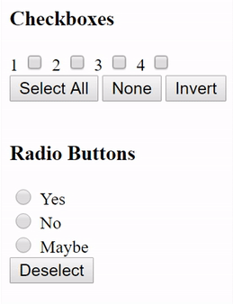

# Invert Selection (Toggle Selection) Checkboxes & Radio Buttons (HTML forms)

Uses jQuery & JavaScript to select the opposite of any checkboxes that are currently selected

## [Live Demo](https://npatullo.w3.uvm.edu/toggle/)
  
This uses PHP, but you can simply `view page source` to get a pure HTML version

## jQuery Functions
- `Invert Current Selection` (checkboxes only)
- `Select All`
- `Select None`

`Select None` works to **deselect radio buttons**  
**This is for mutually exclusive choices, but when the entire is question optional & you want** ***`no response`*** **to be valid**  
The other 2 functions *can* be used on radio buttons, but **aren't effective** since radio buttons are mutually exclusive.  
**Results in the last radio button being selected**  
It doesn't break anything, just doesn't work as intended

No CSS just to make things easier to understand  
Possible improvements could be styling the buttons

## Code Details & Usage
### jQuery Functions (General Usage)
- jQuery functions work by taking in an input parameter which is the `name` attribute of an HTML input tag  
This should be the `name` **for a group of elements**  
The action to **select all, none, or invert** is only performed on that group
*You should create a new different set of buttons for each group where you want the functionality*
- The `name` attribute of each checkbox in a group **must have square brackets `[]` at the end**
`<input type='checkbox' id='chk1' name='chkBoxes[]' value='1'>`  
`<input type='checkbox' id='chk2' name='chkBoxes[]' value='2'>`  
**Notice the `[]` in `name='chkBoxes[]'`**  
This puts an array of checkboxes in the `$_POST` array when the form is submitted, instead of individual checkboxes. (For easier processing)
- [Read this article](http://www.wastedpotential.com/html-multi-checkbox-set-the-correct-way-to-group-checkboxes/) to learn about **checkbox groups**
- **Radio buttons** are mutually exclusive by design so no need for brackets `[]`, just group them by having the **same exact `name` attribute for a group**
- An HTML button with an `onClick` event handler must be placed on the page near the checkboxes with the **correct argument in the function call**  
`<input type="button" name="btnInvert" onclick="invert('chkBoxes[]')" value="Invert">`  
This says:
    1. Call the `invert()` function when clicked
    2. Pass in the argument `chkBoxes[]`
    3. Only `invert()` the checkboxes in the group `chkBoxes[]`
- The only difference for `selectAll()` and `selectNone()` is the name of the function to call
- **REMEMBER TO CHANGE THE INPUT PARAMETER TO THE FUNCTION FOR EACH SET OF BUTTONS YOU CREATE**  
Otherwise clicking 1 buttong will affect multiple groups
- &nbsp;
- jQuery functions set the **property** of an HTML input element using `item.prop("checked", true);` because `item.attr('checked','checked');` doesn't work  
`attr` updates the HTML & you can see it happen in realtime using *Inspect Element*, but the actual page doesn't change
- `selectAll` simply adds `element.prop("checked", true);` to every element in a group regardless of its current state  
This guarantees all items in a group are checked & it doesn't hurt to set the property to `true` if it's already `true`
- `selectNone` is the opposite & simply sets the `property` to `false`
- The `invert` function checks if an input is checked (true/false) & sets the new property to the opposite of its previous state by negating `true` or `false`
- &nbsp;
- **USE `selectNone` ON RADIO BUTTONS TO "DE-SELECT" THE RADIO BUTTON ALTOGETHER, BUT `invert` & `selectNone` WON'T WORK FOR RADIO BUTTONS***

### PHP Specific
- Form submits to itself
- Prints out the contents of the `$_POST` array (empty to start with since form isn't submitted)
- Uses a `for loop` to print checkboxes & labels (or just use the HTML version)

## Previous Versions (failed attempts)
The `attempts/` folder is a collections of my initial versions which didn't pan out

### Tutorial Sources
I cobbled together my own `invert()` function based on various sources because none of them individually was exactly what I was looking for
- **[JQuery checkboxes inverse selection | Marko Jakic](http://markojakic.net/jquery-checkboxes-inverse-selection) Probably the most help, but added to it & expanded compact if-else form**
- **[Stack Overflow: javascript - Why is jQuery is not checking/unchecking checkbox](http://stackoverflow.com/a/18439482) finally figured out why adding `checked` wasn't actually updating the html**
- [Javascript-invert the CheckBoxe selection](http://www.itechies.net/tutorials/jscript/jsexample.php-pid-check-invert.htm) Older JavaScript method NOT using jQuery. 1st one I got to work at all, but didn't use much else
- [jQuery Checkboxes: Select All, Select None, and Invert Selection](https://www.abeautifulsite.net/jquery-checkboxes-select-all-select-none-and-invert-selection) A start, but not much help
- [Stack Overflow: jQuery hasAttr checking to see if there is an attribute on an element](http://stackoverflow.com/a/1318088) some help on checkbox event handling, but not complete
- [CSS-Tricks: A jQuery hasAttr() Equivalent](https://css-tricks.com/snippets/jquery/make-an-jquery-hasattr/) testing if an an element has an attribute
- [Stack Overflow: jQuery checkbox event handling](http://stackoverflow.com/a/29367737) helped when finding how to call functions
-  &nbsp;
- [HTML Multi checkbox set - the correct way to group checkboxes | wasted potential](http://www.wastedpotential.com/html-multi-checkbox-set-the-correct-way-to-group-checkboxes/)
